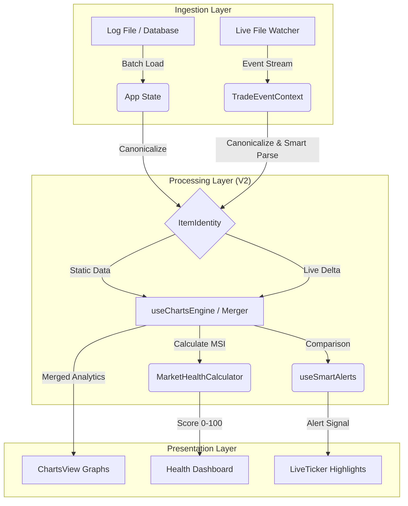

# Technical Documentation: TortaApp Charts Engine (V2.0)

> **Status:** Production Ready (Phase 1-5 Complete)
> **Version:** 2.0.0 "Venerable Whale"
> **Last Updated:** December 14, 2025

## 1. System Overview
The **Charts Engine** is the visual analytics core of TortaApp. It transforms raw trade logs (from file uploads, database, or live game feed) into actionable market intelligence. 

In Version 2.0, the engine was rewritten to support **Incremental Analytics**, **Semantic Item Identity**, and **Real-Time Market Health** monitoring.

## 2. Evolution: Before vs After

| Feature | **Charts Engine V1 (Legacy)** | **Charts Engine V2 (Evolution)** |
| :--- | :--- | :--- |
| **Data Processing** | `O(N)` Full Re-calculation on every new trade. | `O(1)` Incremental Updates using `analyticsMerger`. |
| **Memory Usage** | High (All history kept in raw state). | Optimized (Aggregated buckets for history). |
| **Item Identity** | Exact String Match (Fragmented data). | **Canonical Identity** (Snake_case IDs + Alias Maps). |
| **Live Feed** | Separated from Charts (No visual updates). | **Unified Pipeline**. Charts animate in real-time. |
| **Parsing** | Basic Regex (Price Only). | **Smart Parsing** (Quantity `152x` + Unit Price Math). |
| **Metrics** | OHLC Only. | **MSI (Market Stability Index)**, Seller Profiling, Heatmaps. |
| **Alerts** | None. | **Smart Buy Alerts** (Golden Border for <20% deals). |

## 3. Core Architecture (V2)

The engine allows for the "Hot-Swapping" of data sources and seamless merging of static history with live streams.

### A. The Identity Layer (`services/ItemIdentity.ts`)
*   **Problem:** Users type "LG Anvil", "Large Anvil", "large anvil [90ql]" for the same item.
*   **Solution:** A canonicalization service that:
    1.  Strips bracketed metadata `[90ql]`, `[10s]`.
    2.  Removes irrelevant prefixes/suffixes (`Wheat Sleep Powder` -> `Sleep Powder`).
    3.  Resolves Aliases (`Sleeping` -> `Sleep`).
    4.  Generates a stable `canonical_id` (e.g., `sleep_powder`) for DB indexing.

### B. The Incremental Merger (`services/analyticsMerger.ts`)
*   **Problem:** Re-calculating 50,000 historical trades every time 1 new trade arrives causes UI freeze.
*   **Solution:** 
    *   **Step 1:** Calculate `StaticAnalytics` *once* on load.
    *   **Step 2:** On new trade, create a lightweight `LiveAnalytics` delta.
    *   **Step 3:** Merge `Static + Live` in `O(Bins)` time (milliseconds) instead of `O(Trades)`.

### C. Smart Parsing (`services/dataUtils.ts`)
*   **Logic:**
    *   Detects `152x` or `x152` patterns.
    *   Detects `bulk`, `all`, `total` keywords.
    *   If bulk detected, `Price = TotalPrice / Quantity`.
    *   Ensures charts reflect the *Unit Price*, preventing fake spikes from bulk sales.

## 4. Visual Components

### `ChartsView.tsx`
The main orchestrator. It manages:
*   **Item Selection:** Dropdown populated by `getDistinctItems`.
*   **View Modes:** Price History, Candlesticks, Heatmap, Scatter Plot.
*   **Sub-Components:**
    *   `MarketHealthDashboard`: Visualizes the MSI score (0-100).
    *   `SellerProfile`: Shows top competitors.

### `LiveTradeTicker.tsx`
*   **Role:** Displays the raw feed.
*   **V2 Upgrade:** Now receives `marketData` to perform real-time price comparison.
*   **Visuals:** Renders a **Golden Border** and Flame Icon 🔥 when `useSmartAlerts` detects a deal.

## 5. Data Flow Diagram

## 6. Future Roadmap (Phase 6+)

*   **Configurable Thresholds:** User sliders for Alert % and MSI sensitivity.
*   **Predictive AI:** Connecting `MLPredictor` to the V2 data stream.
*   **Portfolio Tracking:** "My Inventory" valuation based on live unit prices.
